<a id="deutsch"></a>
<p align="center">
  
</p>

<h1 align="center">RONDO</h1>

<p align="center">
  Autarker Küchentimer auf einem 1.8"-Runddisplay mit Drehring.<br>
  Kein WLAN, kein Konto, keine App — alles läuft lokal auf dem Gerät.
</p>

<p align="center">
  <b>Deutsch</b> · <a href="#english"><b>English version below ↓</b></a>
</p>

<p align="center">
  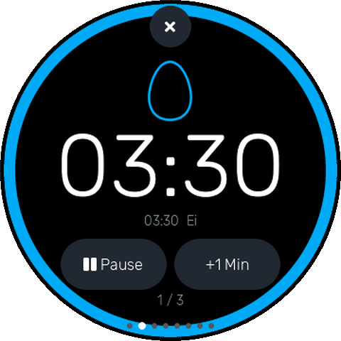
  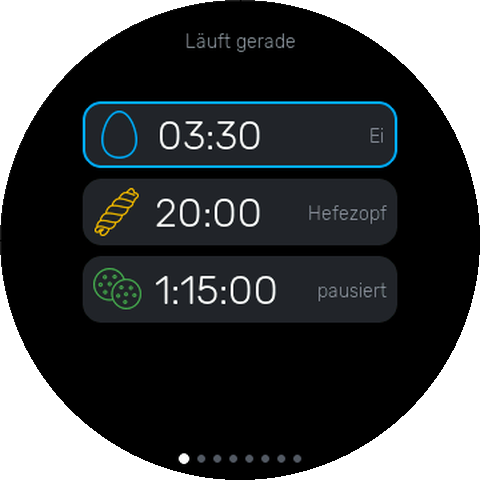
  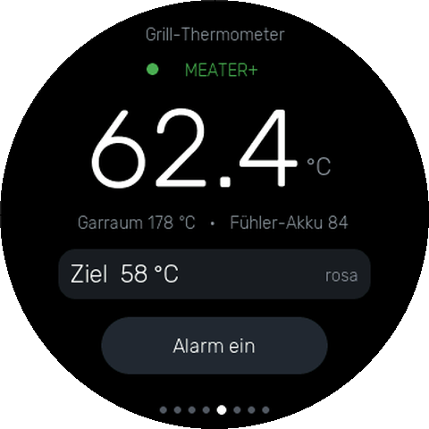
  
</p>

<p align="center">
  
  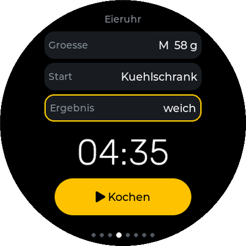
  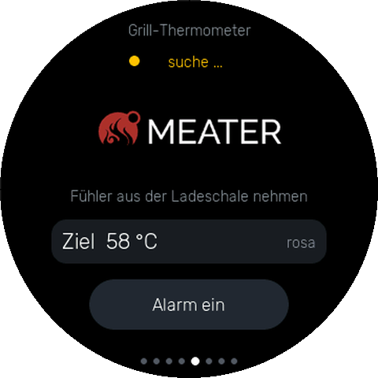
</p>

<p align="center"><sub>Alle Abbildungen kommen aus dem Host-Simulator — das ist
wirklich das, was auf dem Gerät steht.</sub></p>

Gebaut mit Arduino-Core 3.x (pioarduino), LVGL 8.4 und LovyanGFX
(`Panel_ST77916`, QSPI). Eine ausführliche Bedienungsanleitung liegt als PDF bei, in beiden Sprachen:
[deutsch](RONDO-Anleitung.pdf) · [englisch](RONDO-Manual.pdf).

## Hardware

**Guition JC3636K718C** ("K/Knob"-Serie): ESP32-S3, 8 MB Octal-PSRAM, 16 MB
Flash, rundes 360×360-Display (ST77916, QSPI), CST816-Touch, Drehknopf ohne
Taster, PCM5100A mit **eingebautem Lautsprecher**, **WS2812-Ring mit 13 LEDs**,
DRV2605-Haptik (LRA), Akku-ADC, PDM-Mikrofon, microSD.

Der Pinout steht in [`src/board_pins.h`](src/board_pins.h) — aus dem
Herstellerdemo `JC3636K718_knob_EN` und am Gerät nachgeprüft. Er unterscheidet
sich komplett vom JC3636W518; **Pins anderer Boards niemals hierher kopieren.**

Eine Eigenheit, die keine Quelle erwähnt: der **DRV2605 auf `0x5A` ist
bestückt**, obwohl weder das Herstellerdemo noch verbreitete Pinouts ihn
führen. Die Firmware scannt deshalb beim Start den I²C-Bus und schreibt ins
Log, was sie findet.

## Halterung

<p align="center">
  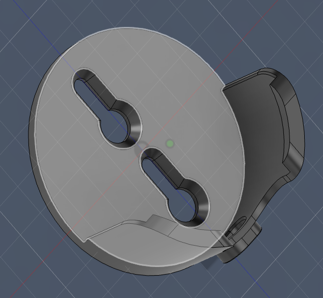
</p>

Eine Schale zum Selberdrucken liegt als
[STL](assets/3d_print/Halter.stl) bei: 71 × 34 × 74 mm, das Gerät sitzt aufrecht
darin, das USB-C-Kabel kommt **von unten** durch den seitlichen Kanal. Zwei
Schlüssellöcher auf der Rückseite hängen sie an zwei Schrauben — abnehmen, ohne
zu schrauben.

Dazu gehört `DISPLAY_ROTATE_180` (siehe unten): erst mit der gedrehten Anzeige
steht das Bild richtig herum, wenn die Buchse unten liegt.

Die Schale ist ein **Ladedock**, kein Gehäuse — das Gerät wird einfach
herausgenommen. Das **BOOT-Pinhole ist im Dock nicht erreichbar**; zum Flashen
also erst herausnehmen. Im Alltag stört das nicht, denn es wird nur für den
Download-Modus gebraucht.

## Bedienung

Eine Regel, überall gleich:

* **horizontal wischen** = Screen wechseln
* **Drehring** = immer der Kontext im aktuellen Screen, nie Navigation
* **vertikal wischen** = innerhalb einer Liste blättern

Der Knopf hat **keinen Taster** — jedes Bestätigen läuft über Touch. Acht
Screens, unten zeigen Punkte die Position; nach dem Start steht man auf *Aktiv*:

| Screen | Inhalt | Drehring |
|---|---|---|
| **Übersicht** | kompakte Liste aller laufenden Timer (und der Stoppuhr) mit Zeit und Zustand; **antippen holt einen in den Aktiv-Screen** | scrollt die Liste |
| **Aktiv** | Restzeit groß, außen ein Fortschrittsring in der Timer-Farbe, Buttons *Pause/Weiter* und *+1 Min*, oben ✕ (mit Rückfrage). Eine laufende **Stoppuhr** ist hier ein Eintrag wie ein Timer. Läuft nichts: das RONDO-Zeichen mit langsam wanderndem Punkt, Tippen führt zum neuen Timer | wechselt zwischen laufenden Timern und der Stoppuhr |
| **Neuer Timer** | `hh:mm:ss` (Segment antippen), Schnellwahl 3/5/10/15 Min, Melodie- und Icon-Button, *Start* + ✕ | stellt Segment, Melodie oder Icon |
| **Eieruhr** | Größe, Kühlschrank/Zimmer, weich/wachsweich/hart → rechnet die Kochzeit und startet den Timer | stellt die gewählte Zeile |
| **Grill-Thermometer** | Kerntemperatur des MEATER-Fühlers gross, dazu Garraum, Fühler-Akku und Verbindungszustand; **Zieltemperatur mit Alarm** | stellt die Zieltemperatur |
| **Stoppuhr** | zählt hoch, mit Zehnteln; läuft im Hintergrund weiter und erscheint dann auch im Aktiv-Screen und in der Übersicht | — |
| **Vorlagen** | Liste; **tippen = starten**, **lang tippen** = Starten/Editieren/Löschen | scrollt die Liste |
| **Einstellungen** | Helligkeit, Lautstärke, **Sprache** (Deutsch/English), *Alarm testen*, Akkuzustand | stellt die gewählte Zeile |

### Zwei Sprachen

Die Oberfläche spricht **Deutsch oder Englisch**, umgestellt in den
Einstellungen — dritte Zeile, mit dem Ring gewählt wie Helligkeit und
Lautstärke. Umgeschaltet wird sofort und überall: Titel, Buttons, Meldungen,
die Namen der 33 Icons und der 20 Melodien.

Alle Texte stehen in `src/lang.cpp` als eine Tabelle `{ deutsch, englisch }`,
adressiert über eine Aufzählung; ein `static_assert` stellt sicher, dass keine
Zeile fehlt. Jeder Screen zeichnet nur neu, wenn sich etwas geändert hat — die
Sprachnummer (`lang_rev()`) gehört deshalb in jede dieser Wachen, sonst bliebe
nach dem Umschalten der alte Text stehen.

Der Simulator rendert beide Sprachen (`tools/sim/build.sh en`) — englische
Texte sind teils länger, und genau daran ist beim Bauen zweimal etwas
angestossen.

Beim Start läuft das **RONDO-Logo**: 13 Punkte im Kreis, der orange wandert
einmal herum — synchron über die 13 echten LEDs des Rings. Antippen überspringt.
Gezeichnet statt eingebettet: ein paar hundert Byte statt 260 KB, und bei jeder
Größe scharf.

### Alarm

Läuft ein Timer ab, holt das Gerät den **Aktiv-Screen nach vorn**, weckt das
Display und blinkt im 130-ms-Takt in der Farbe des Timers. Im selben Takt
schnarrt die Haptik (DRV2605 im RTP-Modus), blinkt der LED-Ring und spielt die
gewählte Melodie in Schleife mit 8-Sekunden-Lautstärkerampe.

Die halbe Bildmitte ist dann Stopptaste — man tippt mit dem Handrücken, nicht
mit der Fingerspitze —, die beiden Buttons werden zu *Stopp* und *+5 Min*. Nach
5 Minuten hört der Alarm von selbst auf, der Timer bleibt als *abgelaufen*
stehen.

### LED-Ring

Der Ring zeigt den Timer, der gerade im Aktiv-Screen steht — nicht immer den
ersten. Schaltet man mit dem Drehring weiter, wechselt er mit.

**Die Farbe ist die Identität des Timers**, nicht sein Fortschritt: jeder
laufende Timer bekommt eine eigene aus einer Palette von acht (vergeben wird
die erste, die kein anderer laufender Timer hat), und dieselbe Farbe färbt
Icon, Fortschrittsbogen und LED-Ring. Der Ring füllt sich anteilig mit der
Restzeit; in den letzten zehn Sekunden pulsiert er.

> Ein früherer Entwurf ließ den Ring von grün über amber nach rot laufen. Das
> beißt sich mit der Timer-Identität — eine Farbe kann nicht gleichzeitig
> „welcher Timer" und „wie viel Restzeit" bedeuten. Geblieben ist das
> Pulsieren am Ende, das signalisiert Dringlichkeit ohne die Farbe zu belegen.

Läuft die **Stoppuhr** und ist sie ausgewählt, wandert stattdessen ein einzelner
cremefarbener Punkt im Sekundentakt herum — sie hat keine Restzeit, die man
füllen könnte, aber „läuft" liest man von weitem.

### Grill-Thermometer (MEATER)

Verifiziert mit einem **MEATER Plus** (Fühler `MT-PR10`, Ladeschale `MT-CP01`).
Der Fühler funkt Bluetooth Low Energy — genau das, was der ESP32-S3 kann.

Verbunden wird mit der **Ladeschale**, nicht mit dem Fühler direkt: sie ist der
Verstärker, damit ist die Reichweite kein Thema. Es braucht **keine Kopplung**,
der Fühler sendet von sich aus (`notify`). Er meldet sich allerdings nur,
solange er **aus der Ladeschale genommen** ist.

| | |
|---|---|
| Dienst | `a75cc7fc-c956-488f-ac2a-2dbc08b63a04` |
| Temperatur | `7edda774-045e-4bbf-909b-45d1991a2876`, 8 Bytes, notify |
| Akku | `2adb4877-68d8-4884-bd3c-d83853bf27b8` |
| Kerntemperatur | `(x[0] + (x[1]<<8) + 8) / 16` = °C |
| Garraum | `(tip + max(0, ((ra - min(48, oa)) * 16 * 589) / 1487) + 8) / 16` |

Ohne Verbindung zeigt der Screen das **MEATER-Logo** statt Platzhalterstrichen —
„--.-" sah nach Fehler aus, das Logo sagt, worauf das Gerät wartet.

**Zieltemperatur.** Der Drehring stellt sie (30–99 °C), daneben steht die
Garstufe in Worten — man denkt eher in „rosa" als in 58 °C. Ist der Alarm
scharf und wird das Ziel erreicht, läuft **derselbe Alarm wie bei einem
abgelaufenen Timer**. Deshalb liegt die Alarmwirkung in `src/alarm.*` und nicht
mehr im Timer-Screen: Blinken, Haptik, Melodie und LED-Ring haben zwei Auslöser,
und zwei Kopien davon wären eine zu viel. Ziel und Scharfschaltung liegen im NVS.

Kennungen und Umrechnung stammen aus der offengelegten Arbeit der Community
([meaterble](https://github.com/nathanfaber/meaterble), [ESPHome-Gist](https://gist.github.com/MortenVinding/a513c0094d0df41a4425612257b3cabc))
und wurden am Gerät gegengeprüft. Beim Verbinden schreibt die Firmware **alle
gefundenen Dienste und Merkmale ins Log** — das war kein Debug-Überbleibsel,
sondern der Beweis, dass dieses Exemplar die dokumentierten Kennungen benutzt.
Es bleibt drin: neuere Modelle (MEATER 2 Plus, SE) verwenden andere Kennungen,
und dann sieht man das in zwei Minuten statt es zu raten.

**Preis in Speicher:** NimBLE nimmt sich rund **100 KB internen RAM**. Danach
waren nur noch 22 KB frei — zu wenig, das wäre früher oder später abgestürzt.
Deshalb läuft der LVGL-Pool jetzt mit 96 statt 128 KB (Spitzenverbrauch laut
Simulator: 64 KB); damit waren wieder rund 55 KB frei — vor der Halbierung der
Zeichenpuffer, die weiter unten steht.

NimBLE selbst läuft dabei in der **Standardkonfiguration**, also mit bis zu drei
gleichzeitigen Verbindungen.

Zur Einordnung der Speicherzahlen, weil sie leicht durcheinandergehen: Der S3
hat **512 KB SRAM**, davon stehen dem Linker **320 KB** für statische Daten zu
(der Rest ist IRAM, Cache und ROM-Reservierung), und der Allokator verwaltet zur
Laufzeit **234 KB Heap**. Frei sind davon rund **82 KB**, der grösste
zusammenhängende Block misst **41 KB** — letzteres ist die Grenze, gegen die
eine einzelne grosse Allokation zuerst läuft (die Zahlen stammen aus dem
Start-Log; woher der Sprung kommt, steht unten bei den Zeichenpuffern). Die 8 MB PSRAM sind praktisch
unberührt; LVGLs Pool liegt bewusst im schnellen internen RAM, liesse sich aber
dorthin verschieben, falls es je eng wird.
Für mehrere Fühler (MEATER Duo, Block) ist der Stack damit bereits gerüstet;
begrenzt ist nur die Anwendung, die heute genau einen Fühler führt.

### Weitere Festlegungen

* Timer laufen über **absolute Zielzeitpunkte** (`esp_timer`), nicht über
  Herunterzählen pro Tick — sonst driftet die Anzeige, sobald das UI hängt.
* Max. **8 gleichzeitige** Timer, max. **20 Vorlagen** (NVS).
* Ein gestarteter Timer wird automatisch zur Vorlage (gleiche Zeit + gleiches
  Icon aktualisiert die vorhandene, statt sie zu duplizieren).
* Nach 60 s ohne Eingabe geht das Backlight aus; Timer laufen weiter, ein Ablauf
  weckt. Die Berührung bzw. Rastung, die aufweckt, löst nichts aus.
* Helligkeit, Lautstärke und Sprache liegen im NVS und überleben den Neustart. Laufende
  Timer überleben einen Reboot **nicht** — ohne RTC ginge das nur unsauber.
* Die **Akkuanzeige ist eine Heuristik**: über 4.25 V (Laden) wird bewusst nur
  die Spannung gezeigt, keine erfundene Prozentzahl. Die Kennlinie gehört pro
  Gerät nachjustiert.
* Ändert sich das Datenformat der Vorlagen oder die Icon-Reihenfolge, muss
  `PRESET_VERSION` in `src/timers.cpp` hoch — sonst zeigen alte Vorlagen auf
  falsche Icons.
* **RONDO übernimmt den Fühler.** Ein MEATER-Fühler lässt genau eine Verbindung
  zu, und die gehört hier dem Gerät — die Hersteller-App bleibt aussen vor. Das
  ist Absicht: RONDO ist für jemanden gebaut, der seine Temperaturen kennt und
  keinen Assistenten braucht, sondern eine Zahl und einen Alarm. Verbunden wird
  mit der Ladeschale (dem Verstärker), nicht mit dem Fühler direkt.
* **Einbaulage.** `DISPLAY_ROTATE_180` in `src/board_pins.h` dreht das Bild um
  180°, damit die USB-Buchse unten liegt (Ladedock). Mitgedreht werden Bild
  (`lcd.setRotation(2)`), die Berührung — der Touchcontroller liefert immer
  Rohkoordinaten des Glases und weiss nichts von der Rotation — und der
  LED-Ring. Der **Drehring nicht**: man schaut weiterhin von vorn auf das
  Gerät, im Uhrzeigersinn bleibt im Uhrzeigersinn. Der Ring hat 13 LEDs, eine
  ungerade Zahl; 180° sind 6.5 davon, ein halber Schritt (knapp 14°) Versatz
  bleibt also übrig (`LED_RING_ROT`).
* **Zeichenpuffer: 2 × 20 Bildzeilen** statt 40. Das macht 29 KB internen RAM
  frei (53 → 82 KB frei, grösster zusammenhängender Block 30 → 41 KB) und kostet
  gemessen ein Drittel mehr Zeit je Vollbild (42 → 56 ms, weil LVGL 16 statt 10
  Übertragungen braucht). Am Gerät ist der Unterschied nicht wahrnehmbar; die
  Messung lässt sich mit `-D PERF_TEST` jederzeit wiederholen.
* **LVGL-Heap: 96 KB.** Mit 64 KB schlug `lv_mem_alloc` beim Aufbau der
  Alarmmasken fehl, und LVGLs Assert-Handler ist ein `while(1)` — das Gerät wäre
  im Alarm stillschweigend stehengeblieben. Der Simulator schreibt zu jedem
  Screen den freien Heap mit, damit so etwas auffällt.

## Inbetriebnahme

```bash
pio run -t upload --upload-port /dev/cu.usbmodemXXXX
```

Der erste Flash **muss über USB** laufen (16 MB, eigene Partitionstabelle).

Steckt das Gerät im Ladedock, muss es zum Flashen heraus — das BOOT-Pinhole liegt dort verdeckt.

Ohne Zutun taucht kein serieller Port auf — die Werksfirmware meldet sich als
`ESP USB DEVICE` (PID `0x4001`). Für den Download-Modus: **Strom ganz weg**,
Büroklammer ins **BOOT-Pinhole links neben USB-C**, drücken und halten, *dann*
USB einstecken, ~2 s halten, loslassen. Danach erscheint `cu.usbmodem*`.

Nach dem Flashen hilft **kein** esptool-Reset — der bootet immer wieder in den
Download-Modus (`rst:0x15`); es braucht einen echten Power-On-Reset, also USB
abziehen und neu einstecken.

**Kontrolle.** `pio device monitor` sollte zeigen:

```
[boot]  Kuechentimer auf Guition JC3636K718C
[touch] CST816 ok
[i2c]   gefunden: 0x15 0x5A
[haptic] DRV2605 ok (LRA)
[knob]  Impulsgeber bereit (links GPIO2, rechts GPIO1)
[audio] I2S ok
[batt]  4.33 V (Zelle)
```

Stimmen Rot und Blau nicht, `cfg.rgb_order` in `src/lgfx_knob.h` umdrehen; ist
alles invertiert, `cfg.invert`. Landen Berührungen woanders, die Schalter
`TP_SWAP_XY` / `TP_MIRROR_X` / `TP_MIRROR_Y` in `src/board_pins.h`.

## Der Drehknopf

Das ist **kein Quadraturgeber** — ein PCNT-Encoder liest hier null. Pro Rastung
kommt ein LOW-Impuls, links auf GPIO2, rechts auf GPIO1. Am Gerät
mitgeschnitten kamen zwei Eigenheiten dazu, ohne die sich der Ring zäh und
ungenau anfühlt:

* Es sind **zwei** Impulse pro Rastung (67–125 ms auseinander, der erste auf
  halbem Weg) — ungeteilt springt die Anzeige schon beim halben Klick.
  Deshalb `KNOB_PULSES_PER_DETENT` = 2.
* Bei jeder Rastung **klingelt die Gegenleitung nach**: ein Schwall in
  derselben Millisekunde plus einzelne Nachzügler noch nach ~50 ms. Die zählten
  als Gegenschritt und verwarfen die angefangene Rastung. Deshalb 4 ms Sperre
  je Leitung, und ein Richtungswechsel wird erst 150 ms nach dem letzten
  gezählten Impuls akzeptiert.

Beschleunigung greift erst nach 6 zügigen Rastungen am Stück (5er-Schritte)
bzw. 14 (10er) — früher greift sie beim normalen Bedienen und die Anzeige
springt. Dreht der Ring gefühlt verkehrt herum: `KNOB_INVERT`.

Zum Nachmessen `-D DIAG_MODE` in `platformio.ini` einkommentieren: grüne
Statuszeile auf dem Display plus Impulsprotokoll auf Serial (blockiert nicht,
auch ohne Zuhörer).

## Layout im Simulator prüfen

Das runde Panel verzeiht keine Ecken: was außerhalb des Kreises liegt, ist weg.
`tools/sim` übersetzt **dieselben** UI-Dateien für macOS, rendert alle Screens
nach `tools/sim/out/*.png`, meldet jedes Widget, das aus dem sichtbaren Kreis
ragt, und schreibt den freien LVGL-Heap mit.

```bash
./tools/sim/build.sh
```

## Assets

**33 Icons** (weiße Strichzeichnung, zur Laufzeit in der Timer-Farbe
eingefärbt) liegen als Originale in `assets/icons/`; die LVGL-Daten erzeugt
`python3 tools/convert_icons.py assets/icons`. **20 Melodien** als
`{Frequenz, Dauer}`-Tabellen in `src/melodies.cpp`. Details und Fallstricke:
[`assets/README.md`](assets/README.md).

## Aufbau

```
src/board_pins.h     Pinout (Herstellerdemo + am Geraet geprueft)
src/lgfx_knob.h      LovyanGFX-Config (ST77916 QSPI, Backlight 20 kHz)
src/input_touch.*    CST816-Poller (bewusst ohne Fremdbibliothek)
src/input_knob.*     Impulsdekodierung mit Teiler und Gegenleitungssperre
src/haptics.*        DRV2605 als LRA: Rastung, Bestaetigung, Alarm-Schnarren
src/audio.*          I2S-Tonsynthese, Lautstaerke, Fade-in
src/melodies.*       20 Alarmmelodien als Notentabellen
src/lang.*           Textkatalog Deutsch/English, Umschaltung zur Laufzeit
src/leds.*           WS2812-Ring: Restzeit in der Timer-Farbe, Alarmblinken, Logo
src/battery.*        Spannungsmessung mit Ueberabtastung und Kennlinie
src/meater.*         BLE-Client fuer das MEATER-Grill-Thermometer
src/alarm.*          Alarmwirkung (Blinken, Haptik, Melodie, Ring) fuer beide Ausloeser
assets/logos/        Quellbild fuers MEATER-Logo (tools/convert_image.py)
src/timers.*         Datenmodell, Ablauflogik, NVS
src/ui_splash.cpp    RONDO-Startbild
src/ui*.cpp          Rahmen, sieben Screens, Alarmzustand im Aktiv-Screen
src/gen/             erzeugt: Ziffernfonts (Rubik 92/52/30) + Icon-Bilddaten
assets/icons/        33 Quell-PNGs, Dateiname = ID und Anzeigename
assets/3d_print/     STL der Halterung (USB-C unten) samt Rendering
tools/sim/           Host-Simulator + Layout- und Heappruefung
```

---

<sub>MEATER ist eine Marke von Apption Labs. Dieses Projekt steht in keiner
Verbindung zum Hersteller; die Anbindung nutzt das von der Community
offengelegte Bluetooth-Protokoll.</sub>

---

<a id="english"></a>

<p align="center">
  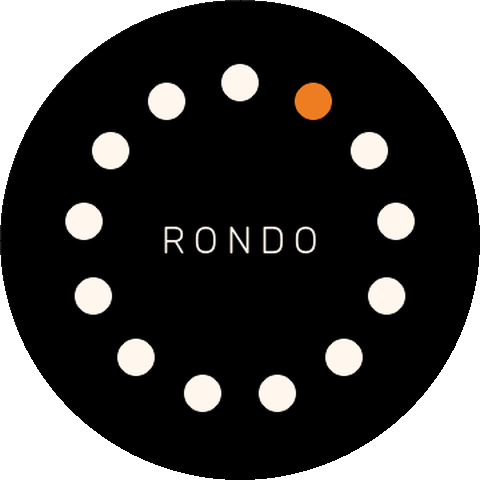
</p>

<h1 align="center">RONDO</h1>

<p align="center">
  A self-contained kitchen timer on a 1.8" round display with a rotary ring.<br>
  No Wi-Fi, no account, no app — everything runs locally on the device.
</p>

<p align="center">
  <a href="#deutsch">↑ Deutsche Fassung oben</a> · <b>English</b>
</p>

<p align="center">
  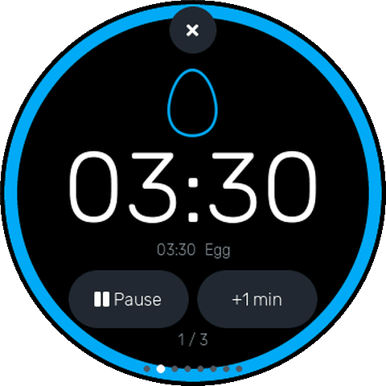
  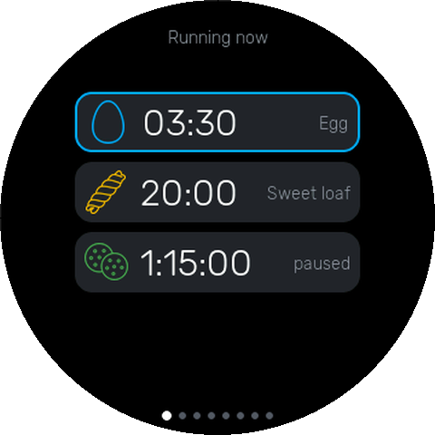
  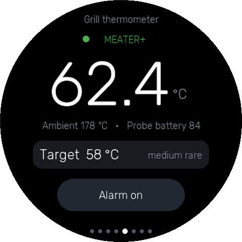
  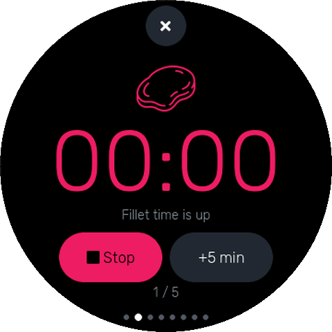
</p>

<p align="center">
  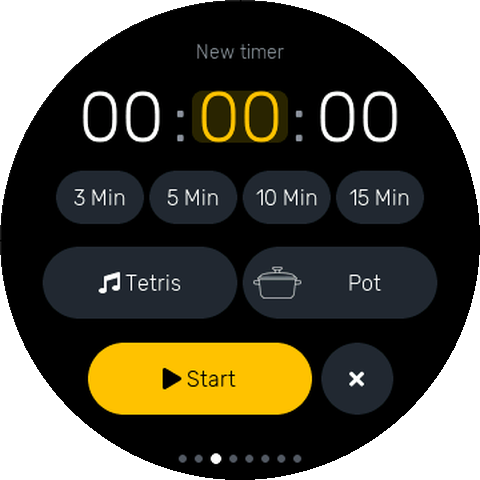
  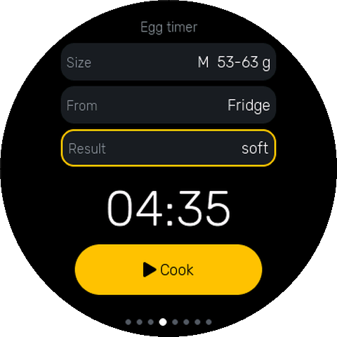
  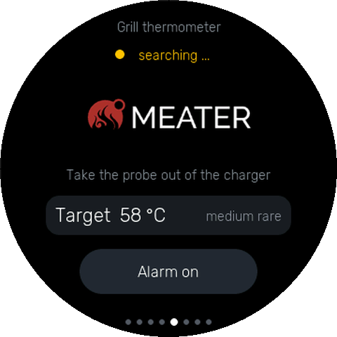
</p>

<p align="center"><sub>Every image comes out of the host simulator — this is
literally what the device shows.</sub></p>

Built with the Arduino core 3.x (pioarduino), LVGL 8.4 and LovyanGFX
(`Panel_ST77916`, QSPI). A detailed user manual is included as a PDF, in both languages:
[English](RONDO-Manual.pdf) · [German](RONDO-Anleitung.pdf).

## Hardware

**Guition JC3636K718C** ("K/knob" series): ESP32-S3, 8 MB octal PSRAM, 16 MB
flash, round 360×360 display (ST77916, QSPI), CST816 touch, rotary knob without
a push switch, PCM5100A with a **built-in speaker**, **WS2812 ring with 13
LEDs**, DRV2605 haptics (LRA), battery ADC, PDM microphone, microSD.

The pinout lives in [`src/board_pins.h`](src/board_pins.h) — taken from the
vendor demo `JC3636K718_knob_EN` and verified on the device. It differs
completely from the JC3636W518; **never copy pins from another board into this
file.**

One quirk no source mentions: the **DRV2605 at `0x5A` is populated**, even
though neither the vendor demo nor the pinouts in circulation list it. That is
why the firmware scans the I²C bus at boot and logs whatever it finds.

## Holder

<p align="center">
  
</p>

A cradle to print yourself is included as an
[STL](assets/3d_print/Halter.stl): 71 × 34 × 74 mm, the device sits upright in
it and the USB-C cable comes in **from below** through the channel at the side.
Two keyhole slots on the back hang it on a pair of screws — lift it off without
unscrewing anything.

It belongs with `DISPLAY_ROTATE_180` (see below): only with the rotated display
is the image the right way up while the socket sits at the bottom.

The cradle is a **charging dock, not an enclosure** — the device simply lifts
out. The **BOOT pinhole cannot be reached while docked**, so take the device out
before flashing. That is no bother day to day: the pinhole is only needed for
download mode.

## Using it

One rule, the same everywhere:

* **swipe horizontally** = change screen
* **rotary ring** = always the context of the current screen, never navigation
* **swipe vertically** = scroll within a list

The knob has **no push switch** — every confirmation goes through touch. Eight
screens, with dots at the bottom showing the position; after boot you are on
*Active*:

| Screen | Content | Rotary ring |
|---|---|---|
| **Overview** | compact list of all running timers (and the stopwatch) with time and state; **tapping one pulls it into the Active screen** | scrolls the list |
| **Active** | remaining time large, a progress ring outside in the timer's colour, buttons *Pause/Resume* and *+1 min*, ✕ at the top (with a confirmation). A running **stopwatch** appears here just like a timer. When nothing runs: the RONDO mark with a slowly travelling dot, and a tap leads to a new timer | switches between running timers and the stopwatch |
| **New timer** | `hh:mm:ss` (tap a segment), quick picks 3/5/10/15 min, melody and icon buttons, *Start* + ✕ | sets the segment, the melody or the icon |
| **Egg timer** | size, fridge/room temperature, soft/medium/hard → computes the cooking time and starts the timer | sets the selected row |
| **Grill thermometer** | core temperature of the MEATER probe, large, plus ambient temperature, probe battery and connection state; **target temperature with alarm** | sets the target temperature |
| **Stopwatch** | counts up with tenths; keeps running in the background and then also appears in the Active screen and the overview | — |
| **Presets** | list; **tap = start**, **long press** = start/edit/delete | scrolls the list |
| **Settings** | brightness, volume, **language** (Deutsch/English), *test alarm*, battery state | sets the selected row |

### Two languages

The interface speaks **German or English**, switched in the settings — third
row, chosen with the ring exactly like brightness and volume. The change is
immediate and everywhere: titles, buttons, messages, the names of all 33 icons
and 20 melodies.

Every string lives in `src/lang.cpp` as one table of `{ german, english }`
pairs, addressed through an enum; a `static_assert` makes sure no row is
missing. Each screen only redraws when something actually changed — which is
why the language revision (`lang_rev()`) belongs in every one of those guards,
or the old text would simply stay on screen after switching.

The simulator renders both languages (`tools/sim/build.sh en`) — English
strings are sometimes longer, and that is exactly what two of them ran into.

At boot the **RONDO logo** plays: 13 dots in a circle, the orange one travelling
around once — in sync across the 13 real LEDs of the ring. A tap skips it. Drawn
rather than embedded: a few hundred bytes instead of 260 KB, and sharp at any
size.

### Alarm

When a timer expires, the device **brings the Active screen to the front**,
wakes the display and flashes at a 130 ms beat in that timer's colour. On the
same beat the haptics rasp (DRV2605 in RTP mode), the LED ring blinks and the
chosen melody loops with an 8-second volume ramp.

Half the screen then becomes the stop button — you tap it with the back of your
hand, not a fingertip — and the two buttons turn into *Stop* and *+5 min*. After
5 minutes the alarm stops by itself and the timer stays put as *expired*.

### LED ring

The ring shows the timer currently in the Active screen — not always the first
one. Turn the ring to another timer and the LEDs follow.

**The colour is the timer's identity**, not its progress: every running timer
gets its own from a palette of eight (the first one no other running timer
holds), and that same colour tints the icon, the progress arc and the LED ring.
The ring fills in proportion to the remaining time; over the last ten seconds it
pulses.

> An earlier draft ran the ring from green through amber to red. That fights the
> timer identity — one colour cannot mean both "which timer" and "how much time
> is left". What survived is the pulsing at the end: it signals urgency without
> occupying the colour.

When the **stopwatch** runs and is selected, a single cream-coloured dot travels
around once per second instead — it has no remaining time to fill, but "it is
running" reads from across the room.

### Grill thermometer (MEATER)

Verified with a **MEATER Plus** (probe `MT-PR10`, charging case `MT-CP01`). The
probe transmits over Bluetooth Low Energy — precisely what the ESP32-S3 does.

The connection goes to the **charging case**, not to the probe directly: the
case is the repeater, so range is a non-issue. **No pairing** is needed, the
probe sends on its own (`notify`). It only reports, though, while it is **out of
the charging case**.

| | |
|---|---|
| Service | `a75cc7fc-c956-488f-ac2a-2dbc08b63a04` |
| Temperature | `7edda774-045e-4bbf-909b-45d1991a2876`, 8 bytes, notify |
| Battery | `2adb4877-68d8-4884-bd3c-d83853bf27b8` |
| Core temperature | `(x[0] + (x[1]<<8) + 8) / 16` = °C |
| Ambient | `(tip + max(0, ((ra - min(48, oa)) * 16 * 589) / 1487) + 8) / 16` |

With no connection the screen shows the **MEATER logo** instead of placeholder
dashes — "--.-" looked like a fault, the logo says what the device is waiting
for.

**Target temperature.** The ring sets it (30–99 °C), with the doneness spelled
out next to it — people think in "medium rare" rather than 58 °C. If the alarm
is armed and the target is reached, **the same alarm runs as for an expired
timer**. That is why the alarm behaviour lives in `src/alarm.*` and no longer in
the timer screen: flashing, haptics, melody and LED ring have two triggers, and
two copies of them would be one too many. Target and armed state are kept in NVS.

The identifiers and the conversion come from the community's published work
([meaterble](https://github.com/nathanfaber/meaterble), [ESPHome gist](https://gist.github.com/MortenVinding/a513c0094d0df41a4425612257b3cabc))
and were cross-checked on the device. On connecting, the firmware logs **every
service and characteristic it finds** — that was not a leftover debug line but
the evidence that this particular unit uses the documented identifiers. It
stays in: newer models (MEATER 2 Plus, SE) use different identifiers, and then
you see it in two minutes instead of guessing.

**The price in memory:** NimBLE takes roughly **100 KB of internal RAM**. After
that only 22 KB were free — too little, it would have crashed sooner or later.
So the LVGL pool now runs at 96 instead of 128 KB (peak usage per the simulator:
64 KB); that brought roughly 55 KB back — before the drawing buffers were
halved, which is further down.

NimBLE itself runs in its **default configuration**, i.e. with up to three
simultaneous connections.

To put the memory numbers in order, because they are easy to mix up: the S3 has
**512 KB of SRAM**, of which the linker gets **320 KB** for static data (the
rest is IRAM, cache and ROM reservation), and the allocator manages **234 KB of
heap** at runtime. About **82 KB** of that is free and the largest contiguous
block measures **41 KB** — the latter is the limit a single large allocation
hits first (the numbers come from the boot log; where the jump came from is
below, under drawing buffers). The 8 MB of PSRAM are practically untouched;
LVGL's pool sits in fast internal RAM on purpose, but could be moved there if it
ever gets tight. For several probes (MEATER Duo, Block) the stack is therefore
already prepared; what is limited is the application, which today handles
exactly one probe.

### Further decisions

* Timers run on **absolute target timestamps** (`esp_timer`), not on
  decrementing per tick — otherwise the display drifts as soon as the UI stalls.
* Max. **8 simultaneous** timers, max. **20 presets** (NVS).
* A started timer automatically becomes a preset (same duration + same icon
  updates the existing one instead of duplicating it).
* After 60 s without input the backlight goes off; timers keep running and an
  expiry wakes the device. The touch or detent that wakes it triggers nothing.
* Brightness, volume and language live in NVS and survive a restart. Running
  timers do **not** survive a reboot — without an RTC that could only be done
  badly.
* The **battery display is a heuristic**: above 4.25 V (charging) it
  deliberately shows only the voltage, not an invented percentage. The curve
  should be trimmed per device.
* If the preset data format or the icon order changes, `PRESET_VERSION` in
  `src/timers.cpp` must go up — otherwise old presets point at the wrong icons.
* **RONDO takes the probe.** A MEATER probe accepts exactly one connection, and
  here it belongs to the device — the vendor app stays out. That is deliberate:
  RONDO is built for someone who knows their temperatures and does not need an
  assistant, just a number and an alarm. The connection goes to the charging
  case (the repeater), not to the probe directly.
* **Mounting orientation.** `DISPLAY_ROTATE_180` in `src/board_pins.h` turns
  the image by 180° so the USB socket sits at the bottom (charging dock). Image
  (`lcd.setRotation(2)`), touch — the touch controller always reports raw glass
  coordinates and knows nothing about the rotation — and the LED ring all turn
  with it. The **rotary ring does not**: you still face the front of the
  device, so clockwise stays clockwise. The ring has 13 LEDs, an odd number;
  180° is 6.5 of them, so half a step (just under 14°) of offset remains
  (`LED_RING_ROT`).
* **Drawing buffers: 2 × 20 display lines** instead of 40. That frees 29 KB of
  internal RAM (53 → 82 KB free, largest contiguous block 30 → 41 KB) and costs
  a measured third more time per full frame (42 → 56 ms, because LVGL needs 16
  transfers instead of 10). On the device the difference is not perceptible; the
  measurement can be repeated any time with `-D PERF_TEST`.
* **LVGL heap: 96 KB.** At 64 KB, `lv_mem_alloc` failed while building the alarm
  masks, and LVGL's assert handler is a `while(1)` — the device would have
  silently frozen during an alarm. The simulator logs the free heap for every
  screen so that this gets noticed.

## Getting it running

```bash
pio run -t upload --upload-port /dev/cu.usbmodemXXXX
```

The first flash **must go over USB** (16 MB, custom partition table).

If the device is sitting in its charging dock, take it out before flashing — the BOOT pinhole is covered in there.

Left alone, no serial port appears — the factory firmware enumerates as
`ESP USB DEVICE` (PID `0x4001`). For download mode: **cut power completely**,
put a paperclip into the **BOOT pinhole left of the USB-C jack**, press and
hold, *then* plug in USB, hold for ~2 s, release. `cu.usbmodem*` shows up after
that.

Once flashed, an esptool reset does **not** help — it boots straight back into
download mode (`rst:0x15`); it needs a real power-on reset, so unplug USB and
plug it back in.

**Checking.** `pio device monitor` should show:

```
[boot]  Kuechentimer auf Guition JC3636K718C
[touch] CST816 ok
[i2c]   gefunden: 0x15 0x5A
[haptic] DRV2605 ok (LRA)
[knob]  Impulsgeber bereit (links GPIO2, rechts GPIO1)
[audio] I2S ok
[batt]  4.33 V (Zelle)
```

The boot log is German — it is a diagnostic channel for whoever builds the
firmware, not part of the user interface.

If red and blue are swapped, flip `cfg.rgb_order` in `src/lgfx_knob.h`; if
everything is inverted, `cfg.invert`. If touches land in the wrong place, use
the `TP_SWAP_XY` / `TP_MIRROR_X` / `TP_MIRROR_Y` switches in
`src/board_pins.h`.

## The rotary knob

This is **not a quadrature encoder** — a PCNT encoder reads zero here. Each
detent produces one LOW pulse, left on GPIO2, right on GPIO1. Two quirks
recorded on the device turned out to matter; without handling them the ring
feels sluggish and imprecise:

* There are **two** pulses per detent (67–125 ms apart, the first one halfway) —
  undivided, the display jumps at half a click already. Hence
  `KNOB_PULSES_PER_DETENT` = 2.
* Every detent makes **the opposite line ring**: a burst within the same
  millisecond plus stragglers up to ~50 ms later. Those counted as a step in
  the other direction and discarded the detent in progress. Hence a 4 ms lockout
  per line, and a change of direction is only accepted 150 ms after the last
  counted pulse.

Acceleration only kicks in after 6 brisk detents in a row (steps of 5) or 14
(steps of 10) — any earlier and it fires during normal use, making the display
jump. If the ring feels inverted: `KNOB_INVERT`.

To measure it yourself, uncomment `-D DIAG_MODE` in `platformio.ini`: a green
status line on the display plus a pulse log on serial (non-blocking, also with
nobody listening).

## Checking the layout in the simulator

The round panel does not forgive corners: whatever lies outside the circle is
gone. `tools/sim` compiles **the same** UI sources for macOS, renders every
screen to `tools/sim/out/`, reports every widget sticking out of the visible
circle, and logs the free LVGL heap.

```bash
./tools/sim/build.sh        # German
./tools/sim/build.sh en     # English — longer strings, same layout check
```

## Assets

**33 icons** (white line art, tinted at runtime in the timer's colour) are kept
as originals in `assets/icons/`; the LVGL data is produced by
`python3 tools/convert_icons.py assets/icons`. **20 melodies** as
`{frequency, duration}` tables in `src/melodies.cpp`. Details and pitfalls:
[`assets/README.md`](assets/README.md) (German).

## Layout of the source

```
src/board_pins.h     pinout (vendor demo + verified on the device)
src/lgfx_knob.h      LovyanGFX config (ST77916 QSPI, backlight 20 kHz)
src/input_touch.*    CST816 poller (deliberately without a third-party library)
src/input_knob.*     pulse decoding with divider and opposite-line lockout
src/haptics.*        DRV2605 as LRA: detent, confirmation, alarm rasp
src/audio.*          I2S tone synthesis, volume, fade-in
src/melodies.*       20 alarm melodies as note tables
src/lang.*           German/English string catalogue, switched at runtime
src/leds.*           WS2812 ring: remaining time in the timer colour, alarm, logo
src/battery.*        voltage measurement with oversampling and a curve
src/meater.*         BLE client for the MEATER grill thermometer
src/alarm.*          alarm behaviour (flash, haptics, melody, ring) for both triggers
assets/logos/        source image for the MEATER logo (tools/convert_image.py)
src/timers.*         data model, expiry logic, NVS
src/ui_splash.cpp    RONDO boot screen
src/ui*.cpp          frame, seven screens, alarm state in the Active screen
src/gen/             generated: digit fonts (Rubik 92/52/30) + icon bitmaps
assets/icons/        33 source PNGs, filename = ID and display name
assets/3d_print/     STL of the holder (USB-C at the bottom) plus a rendering
tools/sim/           host simulator plus layout and heap checks
```

Source comments and commit messages are German; the code itself is in English.

---

<sub>MEATER is a trademark of Apption Labs. This project is not affiliated with
the manufacturer; the integration uses the Bluetooth protocol published by the
community.</sub>
